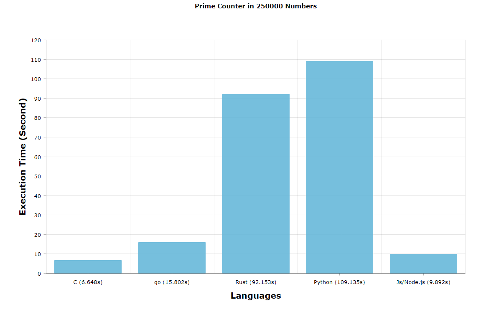

### Time of Execution for Prime Counter in Range 2,250000

##### Computer Config:
```
Windows 10
CPU: Intel(R) Core(TM) i5-2410M CPU @ 2.30GHz
RAM: 8.0 GB DDR3
DISK: samsung SSD 860 EVO 250GB
```

#### C gcc (GCC) 11.2.0
###### Commands:
    1)gcc prime_counter.c -o prime_counter
```sh
$ time ./prime_counter.exe
# 22044

# real    0m6.648s
# user    0m6.608s
# sys     0m0.015s
```

#### Python 3.9.5
```sh
$ time python prime_counter.py
# 22044
# 
# real    1m49.135s
# user    0m0.047s
# sys     0m0.015s
# 
```

#### Rust 1.58.9
###### command: 
    1)cargo new; 
    2)copy code to main.rs
    3)cargo build;
```sh
$ rustc --version
# rustc 1.58.0 (02072b482 2022-01-11)

$ time ./target/debug/prime_counter.exe
# 22044

# real    1m32.153s
# user    0m0.000s
# sys     0m0.031s
```

#### Node.js v14.15.4
```sh
 $ time node ./prime_counter.js 
# 22044

# real    0m9.892s
# user    0m0.046s
# sys     0m0.077s
```

#### go version go1.17.6 windows/amd64
###### command: 
    1)go run prime_counter.go; 
    2)go build prime_counter.go;
```sh
$ time ./prime_counter.exe
$ time ./prime_counter.exe
# 22044

# real    0m15.802s
# user    0m0.000s
# sys     0m0.046s
```

<p float="center">

</p>
